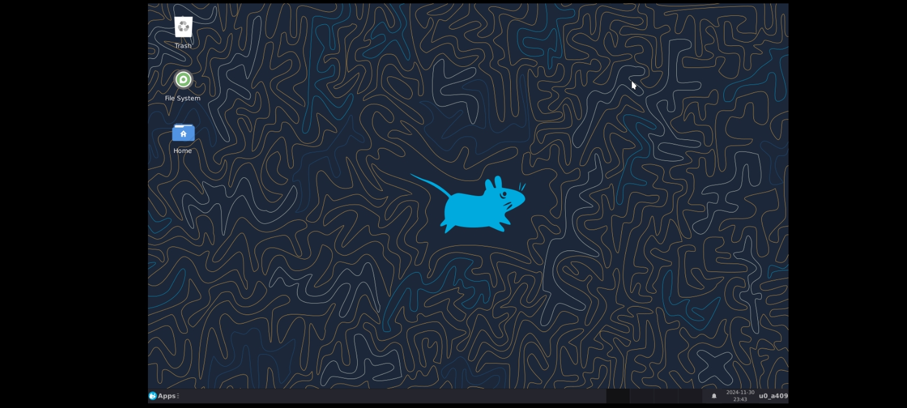
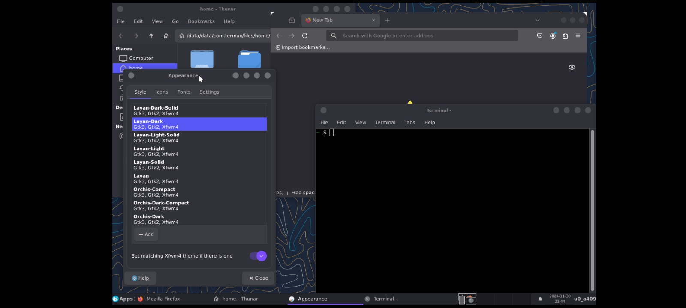
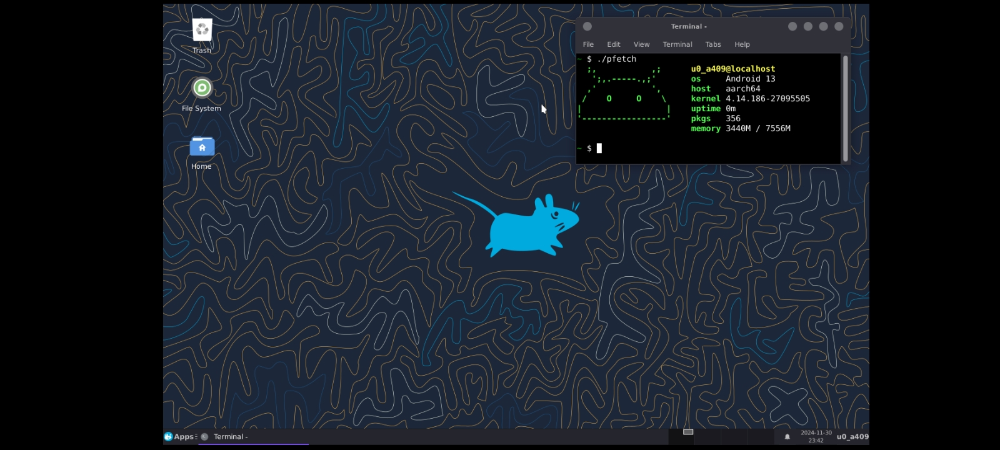

# Termux XFCE <br>
I give you...Termux with a GUI! <br>
Termux does support a GUI (XFCE and LXQT mainly) <br>
XFCE being one of the most customisable and best DEs, I decided to make a script that can install XFCE on Termux without any modifications! <br>
# How to install? <br>
* Just run:
```
apt install git -y && git clone https://github.com/hyperio546/termux-xfce && cd termux-xfce && ./install.sh
``` 
and follow the steps! <br>
# How to access the GUI? <br>
Just install "VNC Viewer" from Play Store (or BVNC for advanced users) <br>
Type `localhost:1` in the connection, and then put the password you chose earlier and then login!
# How to start and stop the server <br>
`startvnc` to start <br>
`stopvnc` to stop <br><br>
# How do I control audio volume?
Open up pavucontrol-qt from the menu system and control audio volume using it.
# How do I make it look better?
* Run:
```
git clone https://github.com/hyperio546/termux-xfce && cd termux-xfce && ./theme.sh
```
Which will install the following themes: <br>
- Orchis GTK theme
- Layan GTK theme
- Papirus icon theme
- Tela circle icon theme <br>
You should see a folder in the home directory called "themes-termux-xfce" which has the required files for the themes.
# Uninstallation
- Run: 
```
git clone https://github.com/hyperio546/termux-xfce && cd termux-xfce && ./uninstall.sh
```
to undo all the changes done.
# Screenshots
 <br>


<br>
<br>
Any issues are welcome for improvement! <br>
A lot of effort was put into this!
